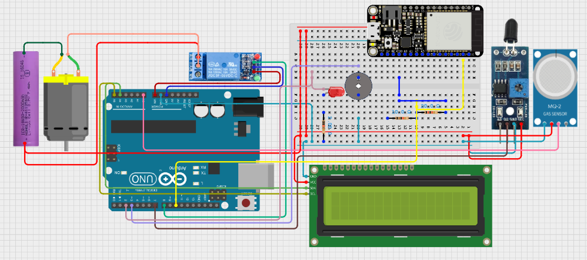

# 🔥 Smart Flame and Gas Emergency Response System with ESP32 SMS Alerts

## 📌 Project Description
The **Smart Flame and Gas Emergency Response System** is an integrated safety solution designed to detect fire and hazardous gas leaks in real-time. By combining the processing power of an **Arduino Uno** with the wireless capabilities of the **ESP32**, the system triggers immediate physical countermeasures and sends remote SMS notifications to ensure safety in homes, laboratories, or industrial settings.

---

## Objectives
* **Real-Time Detection:** Monitor environment for flames and gas leaks (MQ-135).
* **Audio-Visual Alerts:** Immediate notification via Buzzer and LED.
* **Automated Mitigation:** Activate an exhaust fan and high-torque servo motor.
* **Remote Notification:** Utilize ESP32 to send SMS alerts via Wi-Fi/API.
* **Reliability:** Deliver a cost-effective, low-latency embedded safety system.

---

## Materials and Components

| Category | Component |
| :--- | :--- |
| **Input Devices** | MQ-135 Gas Sensor, Flame Sensor |
| **Controllers** | Arduino Uno (Logic), ESP32 (Communication) |
| **Output Devices** | 16×2 I2C LCD, Active Buzzer, LED, DC Fan |
| **Software** | Arduino IDE, Tinkercad, GitHub |

---

## How It Works
1.  **Sensing:** The MQ-135 and Flame sensor constantly poll the environment.
2.  **Processing:** The Arduino Uno evaluates sensor data against predefined thresholds.
3.  **Local Response:** If a hazard is detected, the Arduino triggers the buzzer, displays the status on the LCD, and activates the DC fan/servo.
4.  **Communication:** The Arduino signals the ESP32 via Serial communication, which then connects to a gateway to send an **SMS Alert** to the user's phone.

---

## 🔌 Circuit Diagram
<h2 align="center">Project Diagram</h2>

  

---

## 🖼️ Project Image
Below is the actual prototype of the system:
<h2 align="center">Image of the Project</h2>

  

## 🎥 Project Demonstration

https://github.com/user-attachments/assets/006263da-b047-4367-81f8-495e38b57e4f

## 💻 Code
- 📄 [View ESP32 SMS Notificationn Code](https://github.com/cathymagsakay0416-rgb/Final-Project/blob/main/esp32code.ino)
- 📄 [View Arduino Code](https://github.com/cathymagsakay0416-rgb/Final-Project/blob/main/projfinal.ino)

---

## 📊 Results & Discussion

### Results
* **Successful Detection:** Flame and gas presence were identified in under 1 second.
* **Effective Mitigation:** The exhaust fan successfully lowered gas concentration levels in test enclosures.
* **Remote Connectivity:** SMS alerts were delivered to the registered mobile device reliably.
* **User Interface:** The I2C LCD provided clear, real-time status updates.

### Discussion
The use of the **MQ-135** allowed for broad-spectrum air quality monitoring, while the **Flame sensor** provided a binary high-speed trigger for fire events. Integrating the **ESP32** bridged the gap between a local alarm and a "smart" IoT device, proving that legacy microcontrollers like the Uno can be easily upgraded with modern communication modules. Proper threshold tuning was essential to minimize false positives from ambient light or non-toxic aerosols.

---

## ✅ Conclusion
This project successfully demonstrates a reliable, scalable safety system. By integrating automated hardware responses with cloud-based notifications, it provides a comprehensive safety net suitable for residential and industrial applications.

---

## 📘 Reflection
Through this project, I gained hands-on experience in **sensor fusion** and **cross-board communication**. Troubleshooting the logic between the Arduino and ESP32 deepened my understanding of Serial protocols and API integration. It highlighted how embedded systems can be leveraged to solve critical real-world safety challenges.
